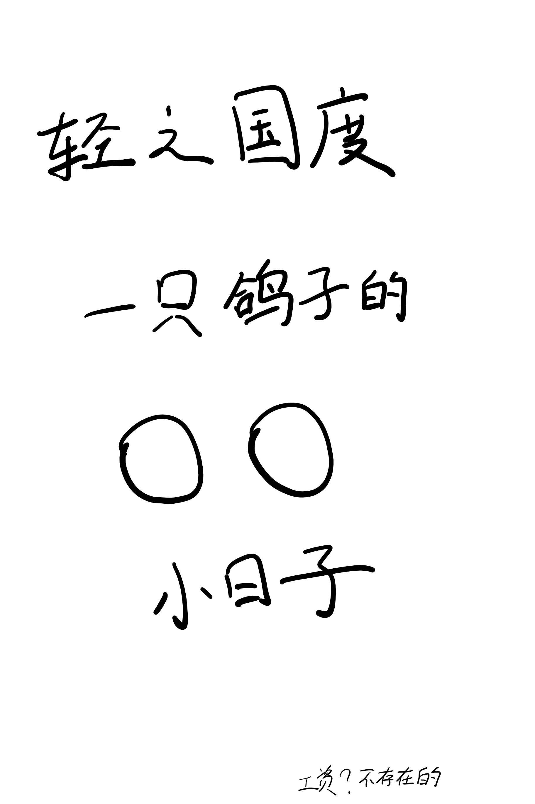

# ひとりぼっちの○○生活

## STORY

这季度的难民救济之一？

## STAFF

- 原作：カツヲ（《Comic电击大王G》连载）
- 监督：安斋刚文
- 总编剧、剧本：花田十辉
- 角色设计：田中纪衣
- 服装设计：今田茜
- 助监督：池下博纪
- 总作画监督：田中纪衣、小田武士
- 道具设计：水村良男
- 美术设定：池田祐二（Studio Wyeth）
- 美术板：一色美绪（Studio Wyeth）
- 美术监督：长冈志织（獏Production）、一色美绪（Studio Wyeth）
- 背景：獏Production、Studio Wyeth
- 色彩设计：高木雅人
- 3D监督：向纯平
- 摄影监督：板仓步
- 摄影：STUDIO CYAN
- 编辑：山岸步奈实（REAL-T）
- 音响监督：藤田亚纪子
- 音响制作：HALF H·P STUDIO
- 音乐：高田龙一（MONACA）、田中秀和（MONACA）
- 音乐监制：斋藤滋（HEART COMPANY）
- 音乐制作：KADOKAWA
- 动画制作：C2C
- 制作：一个人制作委员会

## CAST

- 一里波知：森下千咲
- 砂尾奈子：田中美海
- 本庄亚琉：鬼头明里
- 苏朵嘉·拉琪塔：黑濑优子
- 仓井佳子：市之濑加那
- 八原香衣：小原好美
- 押江照代：高桥未奈美

## HP

http://hitoribocchi.jp/

