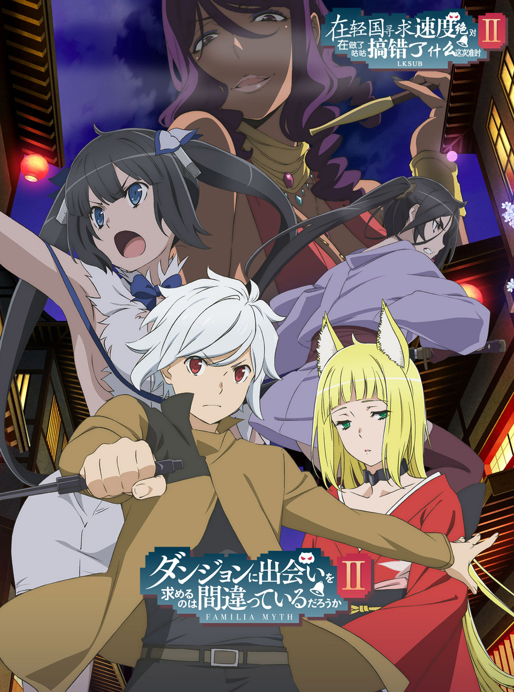

# ダンジョンに出会いを求めるのは間違っているだろうかII

## STORY

故事发生在拥有通称"地下城"的广阔的地下迷宫的迷宫都市欧拉丽，想成为冒险者并且向往像英雄冒险谭中那样的"与异性命运的邂逅"的主人公贝尔·克朗尼，在这个地方遇见了一位小"神仙"赫斯缇雅，而她正四处寻找自己"眷族"的成员。吃了不少"眷族"闭门羹的贝尔在听了其劝诱后，立马就决定加入。某日，贝尔在地下城遭到了怪物"弥诺陶洛斯"的袭击，由于水平之差而无计可施的贝尔面临走投无路的危机，而在千钧一发之际，最强冒险者艾丝·华伦斯坦出手相助。就在这一瞬间，贝尔对艾丝一见钟情。就这样，一段眷族神话正式拉开帷幕。

## STAFF

- 原作：大森藤野
- 角色原案：安田典生
- 监督：山川吉树
- 系列构成：白根秀树
- 角色设计：木本茂树
- 美术监督：水谷利春（MOON FLOWER）
- 色彩设计：安藤智美
- 摄影监督：福世晋吾
- 编辑：坪根健太郎 （REAL-T）
- 音响监督：明田川仁
- 音乐：井内启二
- 制片：GENCO
- 动画制作：J.C.STAFF
- 制作：地下城制作委员会

## CAST

- 贝尔·克朗尼：松冈祯丞
- 赫斯缇雅：水濑祈
- 艾丝·华伦斯坦：大西沙织
- 莉莉露卡·厄德：内田真礼
- 埃伊娜·祖尔：户松遥
- 希儿·福罗瓦：石上静香
- 芙蕾雅：日笠阳子
- 洛基：久保由利香
- 伯特·罗加：冈本信彦
- 琉·利昂：早见沙织
- 韦尔夫·克洛佐：细谷佳正

## HP

http://danmachi.com/danmachi2/