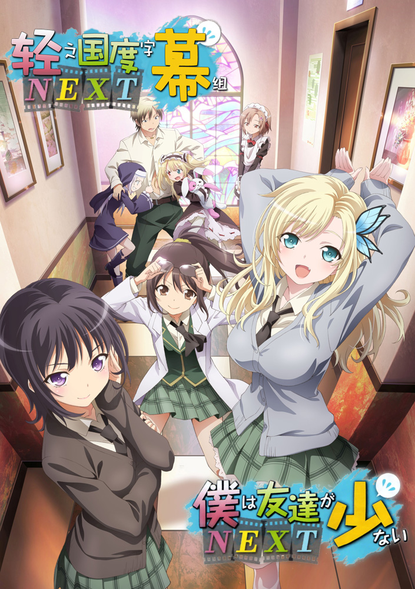

# 僕は友達が少ないNEXT

## STORY

在学校总是独来独往的羽濑川小鹰，在一次偶然的情况下，目击到总是摆出一副臭脸的美少女三日月夜空一个人很开心地自言自语。

小鹰和夜空聊了一下该怎么交朋友的话题，没想到夜空竟然凭着莫名其妙的行动力成立一个以交朋友为目的的问社团。

而且也不知道是哪里搞错，问题美少女们还接二连三地申请入社！

大家卯起来打美少女游戏电玩，一起去游泳、一起演戏。似乎一直没有抓对要领的他们，果真能交到朋友吗？

## STAFF

- 原作：平坂读
- 原作插画：ブリキ
- 监督：喜多幡彻
- 系列构成：浦畑达彦猰坂读
- 脚本：浦畑达彦砂山藏澄
- 角色设定总作画监督：渡边义弘
- 色彩设计：松山爱子
- 美术监督：钉贯彩小滨俊裕
- 美术：美峰
- 合成导演：德田千明
- 3D CGI：井口光隆
- 编辑：右山章太
- 音响监督：本山哲
- 音响制作：Magic Capsule
- 音乐：Tom-H@ck
- 音乐制作：MEDIA FACTORY
- 动画制作：AIC Build
- 制作：制作委员会的朋友很少NEXT

## CAST

- 羽濑川小鹰：木村良平
- 三日月夜空：井上麻里奈
- 柏崎星奈：伊藤加奈惠
- 楠幸村：山本希望
- 志熊理科：福园美里
- 羽濑川小鸠：花泽香菜
- 高山玛丽亚：井口裕香

## HP

http://www.tbs.co.jp/anime/haganai/
