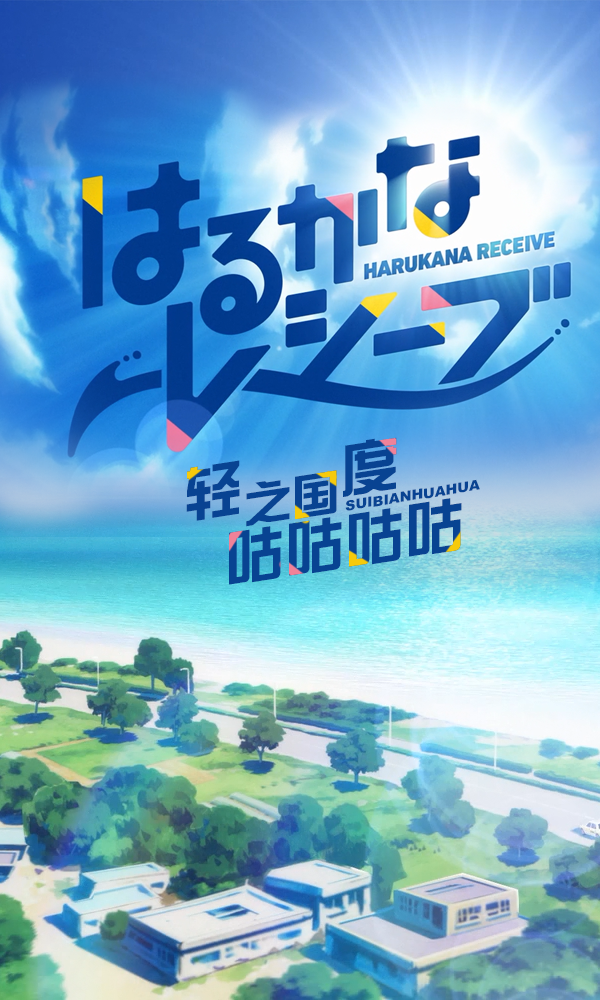

# はるかなレシーブ

## STORY

方文山排球天下第一

## STAFF

- 原作：如意自在
- 监督：洼冈俊之
- 系列构成、脚本：待田堂子
- 角色设计：小田武士
- 次要角色、服装设计：山田真也
- 总作画监督：小田武士、津幡佳明、松川哲也
- 副监督：高桥英俊
- 特技监督：池下博纪、千叶茂
- 主要动画师：松尾信之、宝井俊介
- 道具设计：水村良男
- 美术设定：杉山晋史
- 美术监督：一色美绪
- 背景：Studio Wyeth
- 色彩设计：胜田绫太
- 画面设计、3D监督：向纯平
- 摄影监督：桑良人
- 编辑：柳圭介
- 音响监督：藤田亚纪子
- 音响制作：HALF H・P STUDIO
- 音乐：Rasmus Faber
- 音乐制作：KADOKAWA
- 动画制作：C2C
- 制作：遥的接球制作委员会

## CAST

- 大空遥：优木加奈
- 比嘉彼方：宫下早纪
- 托马斯·红爱：种崎敦美
- 托马斯·惠美理：末柄里惠
- 远井成美：岛袋美由利
- 立花彩纱：伊藤加奈惠
- 大城明里：木村千咲

## HP

http://www.harukana-receive.jp/
