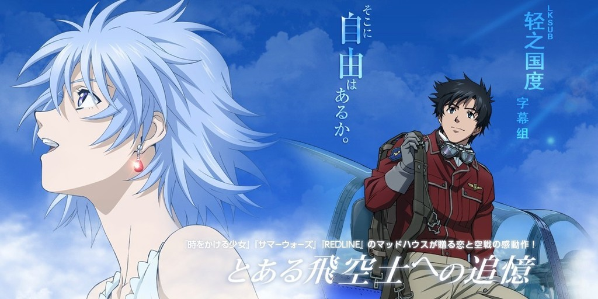

# 境界線上のホライゾンII

## STAFF

- 原作：犬村小六（小学館・ガガガ文庫刊）
- 監督：宍戸淳
- 脚本：奥寺佐渡子
- キャラクターデザイン：松原秀典
- メカニックデザイン：山田勝哉
- 総作画監督：田崎聡
- 美術：橋本和幸
- 音楽：浜口史郎
- 音響監督：清水洋史
- 撮影：棚田耕平
- CG監督：設楽友久
- 色彩設計：小針裕子
- 編集：木村佳史子
- アニメーション制作：マッドハウス
- 制作：トムス・エンタテインメント
- 製作：「とある飛空士への追憶」製作委員会
- トムス·エンタテインメント
- 小学館
- バンダイビジュアル
- サミー
- ムービック
- テレビ東京メディアネット
- キッズステーション
- 東京テアトル
- 配給：東京テアトル

## CAST

- 狩乃 シャルル：神木隆之介/吉永拓斗（少年時代）
- ファナ·デル·モラル：竹富聖花/諸星すみれ（少女時代）
- 千々石 武夫：富澤たけし
- カルロ·レヴァーム：小野大輔
- ディエゴ·デル・モラル：てらそままさ- き
- ドミンゴ·ガルシア：仲野裕
- ラモン·タスク：星野充昭
- マルコス·ゲレロ：長克己
- ヨアキン：浪川大輔
- 狩乃 チセ：新妻聖子

## HP

http://www.hikuushi-tsuioku.com/
 