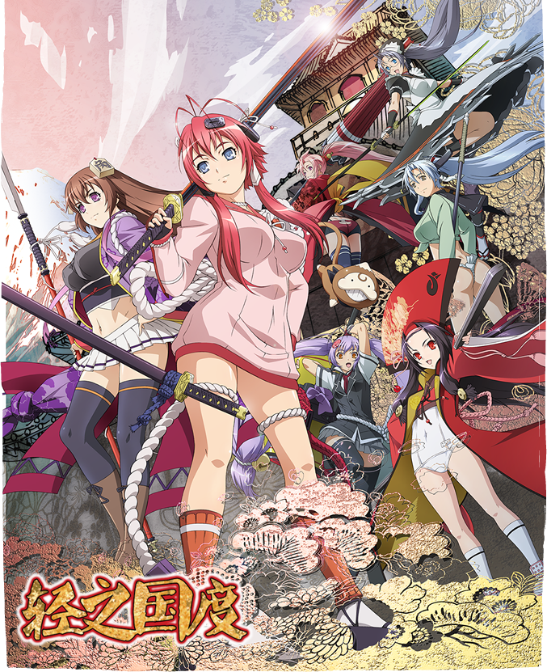

# 百花繚乱 サムライブライド

## STORY

在21世紀初、年號是“平誠”的日本，此時鎖國政策已經完結，不過德川幕府的統治還在繼續，這裡的部分學生對德川家進行 反抗。本作主人公——柳生宗朗，是柳生道場的代理師傅，對執行部的鎮壓行動抱有疑問，為此卻被學生會命令撤走道場。離撤走道場還有一天的時間，宗朗如往常 一樣進行修練，突然間一名手持雙刀的全裸美少女從天花板墮下，她叫柳生十兵衛。之後，眾多以日本歷史上的著名武將為名的少女們出現在宗朗身邊。就這樣，圍 繞宗朗與一群擁有劍豪之名的少女們的學園類愛情戰鬥喜劇開始了。

## STAFF

- 原作：すずきあきら「百花繚亂」（HJ文庫／Hobby JAPAN）
- 角色原案：Niθ
- 監督：KOBUN
- 系列構成：西園悟
- 角色設定・總作畫監督：宮澤努
- 美術監督：東潤一
- 音響監督：明田川仁
- 音樂：加藤達也
- 音樂製作：Lantis
- 制作：GENCO
- 動畫制作：Arms
- 制作：百花繚亂SB製作委員會

## CAST

- 柳生十兵衛：悠木碧
- 柳生宗朗：平川大輔
- 真田幸村：釘宮理惠
- 後藤又兵衛：小林優
- 德川千：壽美菜子
- 服部半藏：後藤沙緒裡
- 直江兼續：豐崎愛生
- 柳生義仙：水原薫
- 查裡士・德・達坦妮雅：小清水亞美
- 猿飛佐助：赤崎千夏
- 宮本武藏：日笠陽子
- 佐佐木小次郎：進藤尚美
- 荒木又右衛門：戶松遙
- 寶藏院胤舜：佐藤聰美
- 德川慶彥：櫻井孝宏
- 前田慶次：能登麻美子

## HP

http://www.hyakka-ryoran.tv/
