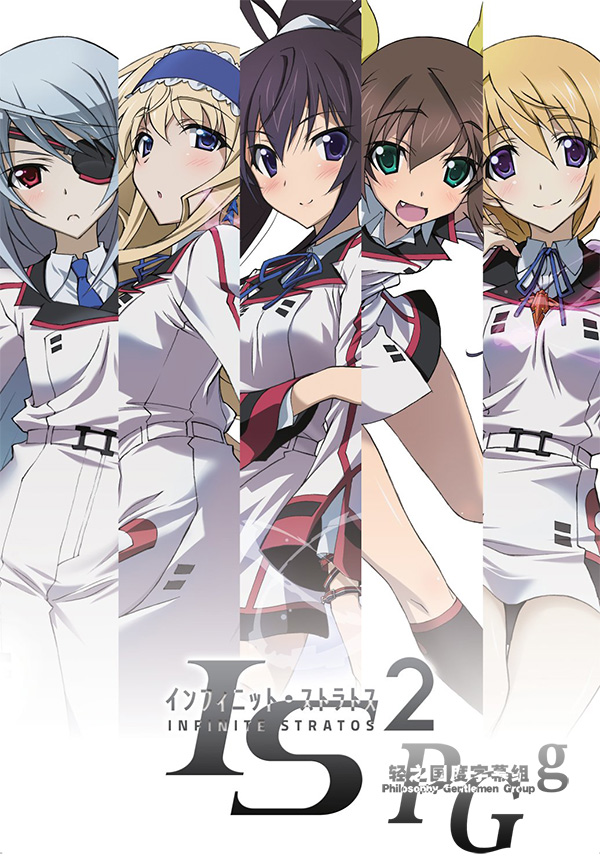

# IS 〈インフィニット・ストラトス〉 2

## STORY

只對女性有反應、世界最強的超級兵器“nfinite Stratos（IS）”。

因為IS的問世，性別平等被破壞，世界變成女尊男卑的社會。主角“織斑一夏”在高中的入學試驗誤入IS操縱者育成學校“IS學園”的試驗會場並意外地啟動了IS。成為全世界關注的“世界上唯一能操縱IS的男性”的一夏，被政府強制就讀向來只有女性的IS學園，在全校師生對他充滿好奇心的視線下，一夏波瀾壯闊校園生活就此展開。

## STAFF

- 原作：弓弦逸鶴
- 監督：菊地康仁
- 角色設定：堀井久美
- 機械設定：高倉武史・麥谷興一(CHOCO)
- 音樂：七瀨光
- 動畫製作：8bit

## CAST

- 織斑一夏：內山昂輝
- 篠之之箒：日笠陽子
- 塞西莉亞・奧爾科特：由加奈
- 凰鈴音：下田麻美
- 夏洛特・迪諾亞：花澤香菜
- 拉芙拉・博迪維希：井上麻里奈
- 更識楯無：齋藤千和
- 更識簪：三森鈴子

## HP

http://www.tbs.co.jp/anime/is2/