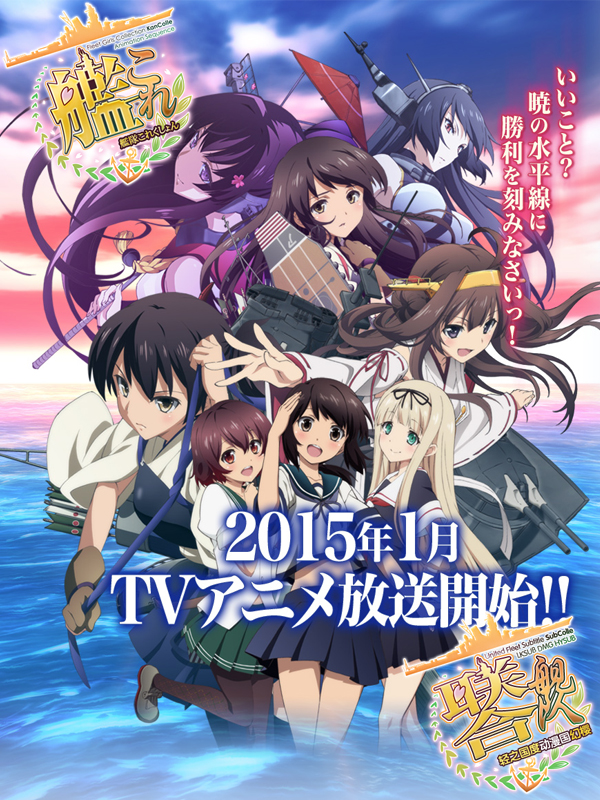

# 艦隊これくしょん -艦これ-

## STORY

电视动画《舰队Collection》改编自娇喘游戏开发、DMM.com营运的同名黄赌毒网页游戏。

动画以驱逐舰吹雪为主人公，以她的视点展开故♀事。
 
## STAFF

- 原作：DMM.com/KADOKAWA GAMES
- 企划：安田猛
- 故事原案/构想：田中谦介
- 制作总指挥：井上伸一郎
- 监督：草川启造
- 系列构成：花田十辉
- 角色设计、总作画监督：井出直美、松本麻友子
- 角色设计协力：しずまよしのり、しばふ、コニシ
- 机械设计：宫泽努、诸石康太
- 物品设计：清水空翔
- 特效监督：桥本敬史
- 美术监督：高桥麻穗
- 色彩设计：上村修司
- CG监督：井野元英二
- CG模型监督：川端英树
- CG制作：Orange
- 摄影监督：伊藤康行
- 编辑：冈裕司
- 音响监督：龟山俊树
- 音响制作：Glovision
- 音乐：龟冈夏海
- 音乐制作：FlyingDog
- 音乐总监：西边诚
- 总监制：安田猛
- 制片人：元长聪、田村淳一郎
- 动画总监：关山晃弘
- 动画制作：diomedéa
- 制作：“舰Colle”联合舰队司令部
 
## CAST

- 吹雪：上坂堇
- 赤城：藤田咲
- 加贺：井口裕香
- 伊势：大坪由佳
- 榛名：东山奈央
- 最上：洲崎绫
- 妙高：种田梨沙
- 龙田：井口裕香
- 睦月：日高里菜
- 岛风：佐仓绫音
- 大和：竹达彩奈
- 三隈：中岛爱
 
## HP

http://kancolle-anime.jp/
