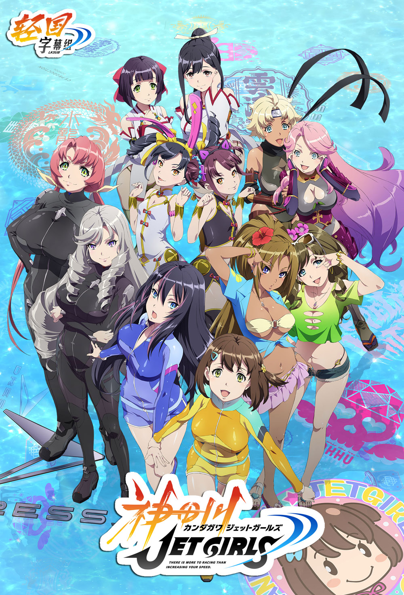

# 神田川JET GIRLS

## STORY

操控机器的"Jetter"和用水枪攻击对手的"Shooter"二人一组乘搭摩托艇，在水面飞驰的运动"Jet Race"成为世界的主流运动。

有着一位传说中的Jetter的母亲，自己也梦想成为Jet Race选手的波黄凛，离开了故乡的岛屿，来到了东京浅草。在那里她遇到了冷酷的美少女苍井美沙，两人成为了搭档。

她们与对手们展开激烈比赛的同时，也在一点点地加深彼此间的牵绊。

## STAFF

- 原作：KJG BOOSTERS
- 原案：高木谦一郎
- 监督：金子拓
- 系列构成：杂破业
- 角色原案：鸣子花春
- 角色设计：宫泽努
- 机械设计：麦谷兴一（CHOCO）・山本七式（SUDACCI）
- 道具设定：宫丰
- 总作画监督：宫泽努、ごとうじゅんじ
- 美术监督：中村典史、平良亚衣子
- 美术设定：佐藤步
- 色彩设计：松山爱子
- 2D WORK：越阪部ワタル
- モニターワークス：长谷川朋史
- 3DCG监督：广住茂徳
- 摄影监督：尾形拓哉、伏原あかね
- 编集：木村佳史子
- 音乐：ノイジークローク
- 音响监督：滨野高年
- 音响効果：出云范子
- 音响制作：マジックカプセル
- 音乐制作：Lantis
- 制片：EGG FIRM
- 动画制作：TNK
- 出品： KJG PARTNERS

## CAST

- 波黄 凛：篠原侑
- 苍井 美沙：小原莉子
- 紫集院 辉夜：田所梓
- 满腹 黑丸：洲崎绫
- 潘 子瑜：大久保瑠美
- 潘 蒂娜：大空直美
- 詹妮弗·皮契：Lynn
- 艾米莉·奥莲姬：法伊鲁兹·爱
- 白石 真夏：安济知佳
- 绿川 柚：前田佳织里
- 环 枫花：朝井彩加
- 翠田 祈：内田彩

## HP

http://kjganime.com/
