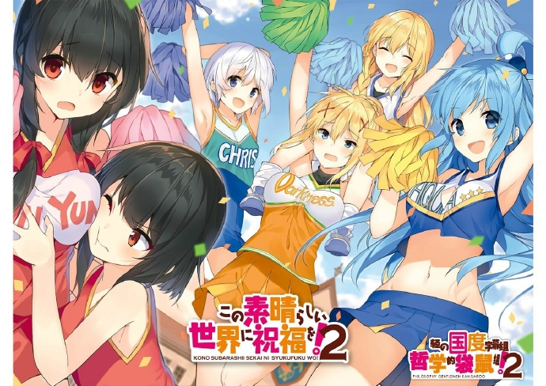

# この素晴らしい世界に祝福を！2

## STORY

热爱游戏的家里蹲少年·佐藤和真的人生，因交通事故（!?）而轻易闭幕……本该是这样，但当他醒来之时，眼前有一位自称是女神的美少女。

"喂，我有点好事 要告诉你。要去异世界吗？只带一样你喜欢的东西没问题喔。""那，我就带着你好了。"

由此开始，在异世界转生的和真的魔王讨伐大冒险开始了……虽然是这么 想的，但他却为了获得衣食住行而开始劳动！想要平稳度日的和真，却由于女神引起的各种问题，而终于被魔王军盯上了!?

## STAFF

- 原作：暁なつめ
- 原作插画：三嶋黑音
- 监督：金崎贵臣
- 系列构成：上江洲诚
- 角色设计：菊田幸一
- 音乐：甲田雅人
- 音乐制作：Columbia
- 动画制作：Studio DEEN
- 制作：该美好制作委员会

## CAST

- 佐藤和真：福岛润
- 阿库娅：雨宫天
- 惠惠：高桥李依
- 达克尼斯：茅野爱衣
- 露娜：原纱友里
- 冒险者：稻田彻
- 克里斯：诹访彩花
- 御剑响夜：江口拓也
- 维斯：堀江由衣
- 无头骑士：安元洋贵
- 悠悠：丰崎爱生

## HP

http://konosuba.com/2nd/