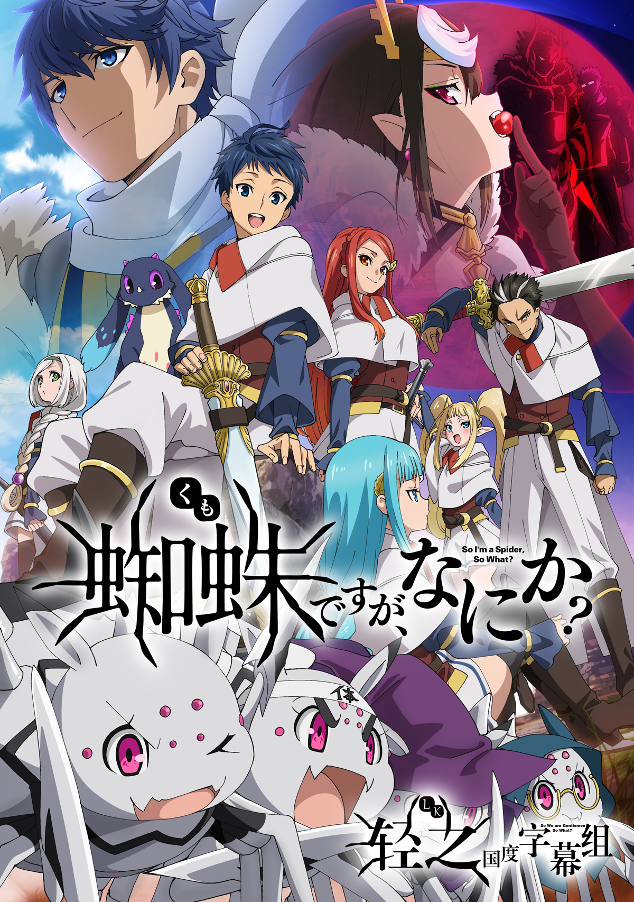

# 蜘蛛ですが、なにか？

## STORY

UMB蜘蛛子 很可以的

## STAFF

- 原作：马场翁《我是蜘蛛，怎么了？》（KADOKAWA BOOKS刊）
- 原作插画：辉龙司
- 监督：板垣伸
- 系列构成：马场翁、百濑祐一郎
- 角色设计：田中纪衣
- 怪物设计：铃木政彦、平田亮、木村博美
- 主动画师：吉田智裕
- 美术监督、美术设定：长冈慎治
- 色彩设计：日比智惠子
- 摄影监督：今泉秀树
- 编辑：樱井崇
- CG监督：山口一夫
- CG动画制作：exsa（制作协力ENGI）
- 音乐：片山修志
- 音响监督：今泉雄一、板垣伸
- 助监督：上田慎一郎
- 动画制作：Millepensee
- 制作：我是蜘蛛，怎么了？制作委员会

## CAST

- 「我」：悠木碧
- 俊：堀江瞬
- 卡迪雅：东山奈央
- 由古：石川界人
- 苏：小仓唯
- 菲：喜多村英梨
- 菲莉梅丝：奥野香耶
- 悠莉：田中爱美
- 尤利乌斯：榎木淳弥

## HP

https://kumo-anime.com/
