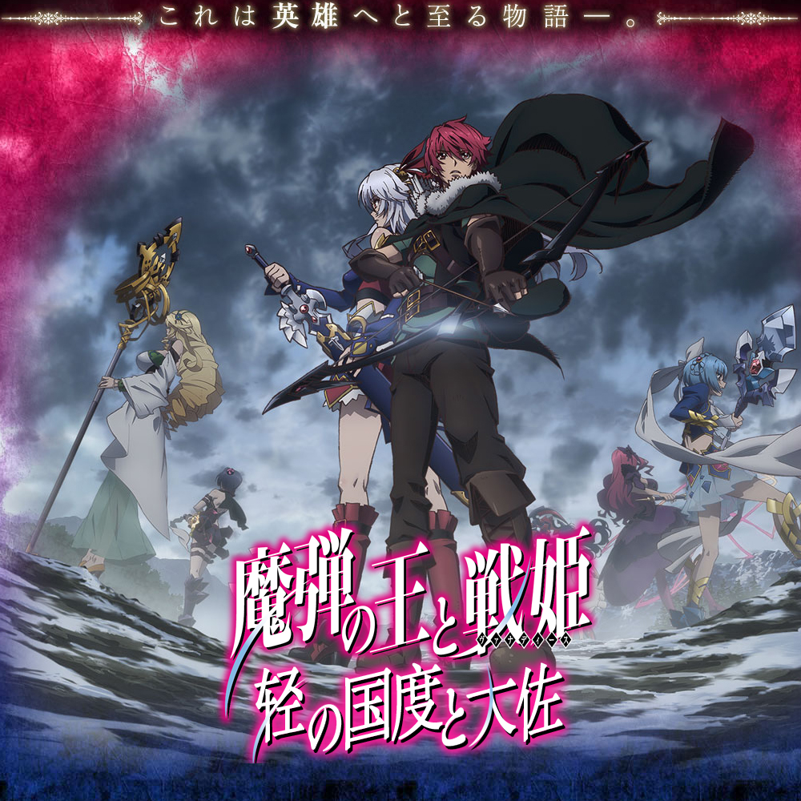

# 魔弾の王と戦姫 

## STORY

吉斯塔特王国的统治体系由国王和七名战姬组成，七位战姬各自统领七块领地，挥舞着超乎想像的强大武器『龙具』驰骋在战场上。布琉努王国的贵族少年堤格尔在与吉斯塔特王国的战争中碰巧遇见了其中一位战姬，「银闪的风姬」艾莲。艾莲对堤格尔高超的弓箭技巧一见钟情，竟然对他说「从今以后你就是我的人了」并将他带往自己的领地……

## STAFF

- 监督·系列构成：佐藤龙雄
- 角色设计·总作画监督：椛岛洋介
- 动画制作：SATELIGHT

## CAST

- 堤格尔维尔穆德·冯伦：石川界人
- 艾蕾欧诺拉·维尔塔利亚：户松遥
- 蒂塔：上坂堇
- 莉姆亚莉夏：井口裕香
- 琉德米拉·露利叶：伊濑茉莉也
- 苏菲亚·欧贝达斯：茅野爱衣
- 亚莉莎德拉·阿尔夏芬：小松未可子
- 伊莉莎维塔·法米那：小林优
- 凡伦蒂娜·古丽卡·艾斯特斯：原田瞳
- 庐里克：兴津和幸
- 马斯哈·罗达特：饭岛肇
- 巴多兰：菅生隆之
- 萨安·泰纳帝：木村良平
- 菲利克斯·亚伦·泰纳帝：松本大
- 罗兰：东地宏树
- 解说：小杉十太郎

## HP

http://madan-anime.jp/

## LINKS

轻之国度字幕组 Facebook 
https://www.facebook.com/lksub

更多轻小说汉化请前往：

轻之国度-在线轻小说-轻小说下载-原创轻小说的聚集地 
http://www.lightnovel.cn/

轻之国度在线轻小说|提供最新最全的日本轻小说阅读 
http://lknovel.lightnovel.cn/