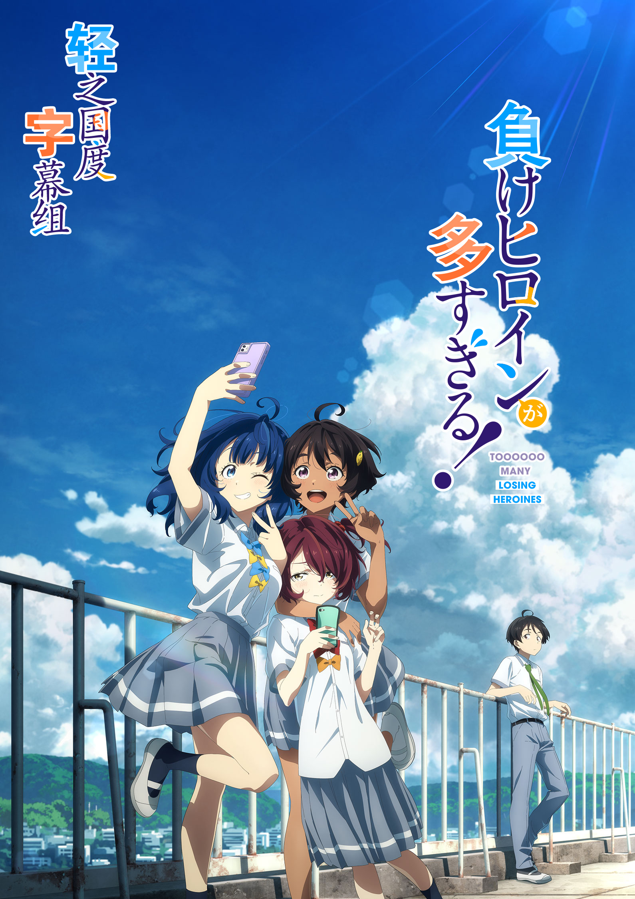

# 負けヒロインが多すぎる！

## STORY

A1的新片，看着质量不错

## STAFF

- 原作：雨森焚火《败犬女主也太多了！》（小学馆「GAGAGA文库」刊）
- 角色原案：いみぎむる
- 监督：北村翔太郎
- 系列构成：横谷昌宏
- 角色设计：川上哲也
- 次要角色设计：斋藤悠(A-1 Pictures)
- 主动画师：三浦琢光(A-1 Pictures)、竹田茜(A-1 Pictures)、原岛未来(A-1 Pictures)
- 视觉设计：大谷蓝生、有原慧悟
- 道具设计：木藤贵之
- 色彩设计：村上彩夏(A-1 Pictures)
- 美术设定：平义树弥(A-1 Pictures)
- 美术监督：畠山佑贵
- 美术Board协力：滕翀
- 美术：草薙
- 3D监督：栗林裕纪
- 摄影监督：宫胁洋平(A-1 Pictures)
- 音乐：うたたね歌菜
- 音响监督：吉田光平
- 音响效果：长谷川哲也
- 制作：A-1 Pictures

## CAST

- 温水和彦：梅田修一朗
- 八奈见杏菜：远野光
- 烧盐柠檬：若山诗音
- 小鞠知花：寺泽百花
- 温水佳树：田中美海
- 玉木慎太郎：小林裕介
- 月之木古都：种崎敦美

## HP

https://makeine-anime.com/