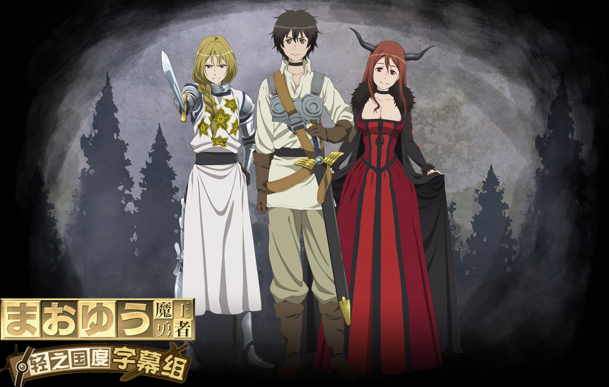

# まおゆう魔王勇者

## STORY

魔王和勇者之间。正统王道RPG的对决——

一边是，自由操控剑和魔法、一夫当关万夫莫开的勇者。一边是，统治魔界一切的魔王。

在魔界耸立的魔王城中，魔王接见了勇者。

魔王给出了不可思议的提议：“成为我的东西吧。”

勇者明白无误的回答：“不!”

为了人界和魔界，这样的两人开始挑战改革这个世界……

## STAFF

- 导演：高桥丈夫
- 脚本：荒川稔久
- 人物设定：工藤昌史 鸟宏明
- 总作画监督：鸟宏明
- 美术监督：小滨俊裕
- 美术设定：青木薰
- 色彩设计：佐野瞳
- 音乐：浜田介史
- 动画制作：Arms

## CAST

- 魔王：小清水亚美
- 勇者：福山润
- 女仆长：斋藤千和
- 女仆姐：户松遥
- 女仆妹：东山奈央
- 女骑士：泽城美雪
- 青年商人：神谷浩史
- 女魔法使：福圆美里
- 老弓兵（执事）：银河万丈
- 冬之王子（冬寂王）：平川大辅
- 军人子弟：铃木达央
- 贵族子弟：梶裕贵
- 商人子弟：寺岛拓笃
- 辣腕会计：立花慎之介
- 中年商人：秋
- 火龙公主：伊藤静
- 铁腕王：町田政则
- 冰雪之女王：藤井麻理子
- 白夜王：东地宏树
- 魔族娘：松井恵理子
