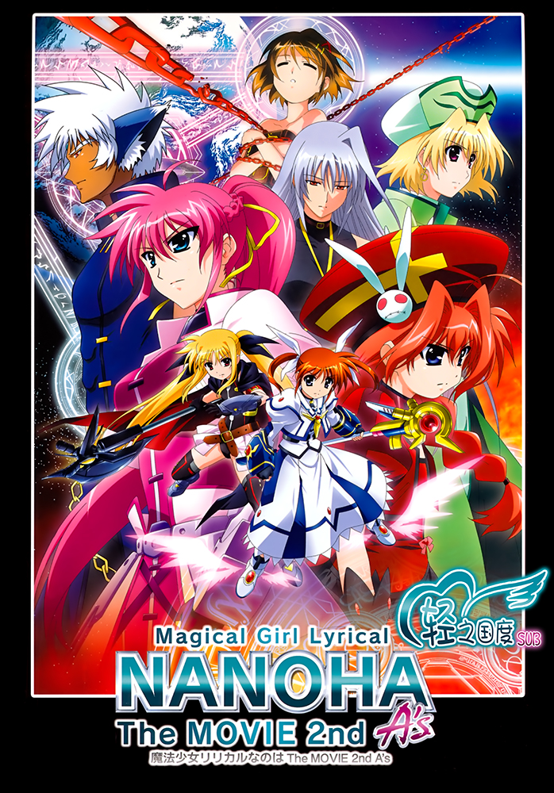

# 魔法少女リリカルなのは The MOVIE 2nd A's

## STORY

本作的时间点被设定于前作普蕾希亚·泰斯塔罗沙事件结束的数个月后。
在乘坐着轮椅、名为八神疾风的少女所有的一本古老精装书突然觉醒之时，从异样的光芒中出现的是……！

2005年放映的动画'魔法少女奈叶A's'的电影化、2010年放映的电影'魔法少女奈叶 The MOVIE 1st'的再续集。

## STAFF

- 企划·制作：NANOHA The MOVIE 2nd A`s PROJECT
- 原作·脚本：都筑真纪
- 监督：草川启造
- 角色设定·总作画监督：奥田泰弘
- 色彩设计：田崎智子
- 美术监督：片平真司

## CAST

- 高町奈叶：田村由香里
- 菲特·泰斯特罗莎：水树奈奈
- 八神疾风：植田佳奈
- 希格纳姆（希格诺）：清水香里
- 维塔：真田麻美
- 莎玛露：柚木凉香
- 扎菲拉：一条和矢
- 暗之书的意志（琳芙丝）：小林沙苗
