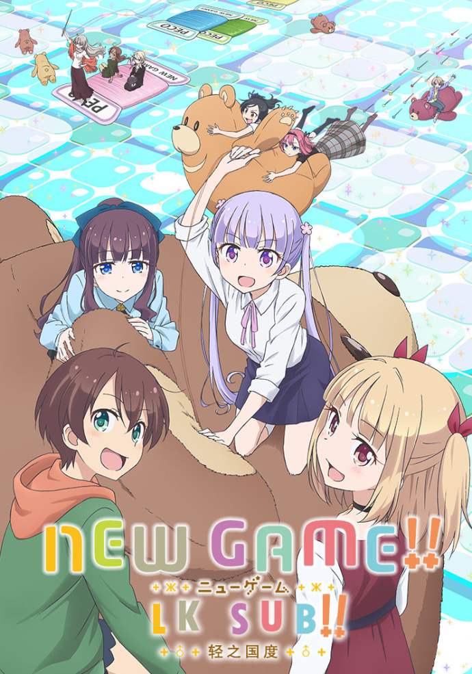

# NEW GAME!!

## STORY

「NEW GAME!」主要讲述了游戏制作公司“Eagle Jump”的新职员凉风青叶，在性格各异的前辈们的指导下努力奋斗的物语。该作目前正于芳文社旗下杂志「Manga Time KIRARA Carat」上连载，单行本至今已推出了3卷。

## STAFF

- 原作：得能正太郎(芳文社「まんがタイムきららキャラット」连载)
- 监督：藤原佳幸
- 副监督：竹下良平
- 系列构成：志茂文彦
- 角色设计：菊池爱
- 总作画监督：菊池爱、冈勇一、天崎まなむ、菊永千里
- 道具设计：中岛绘理
- 美术监督：铃木俊辅
- 色彩设计：石黑启
- 摄影监督：桑野贵文
- 编辑：平木大辅
- 音响监督：土屋雅纪
- 音响效果：小山恭正
- 音响制作：delfi SOUND
- 音乐：百石元
- 音乐制作：KADOKAWA
- 动画制作：动画工房
- 制作：NEW GAME!!制作委员会

## CAST

- 凉风青叶：高田忧希
- 八神光：日笠阳子
- 远山伦：茅野爱衣
- 泷本日富美：山口爱
- 篠田初：户田惠
- 饭岛结音：竹尾步美
- 樱宁宁：朝日奈丸佳
- 阿波根海子：森永千才
- 叶月静：喜多村英梨

## HP

http://newgame-anime.com/
