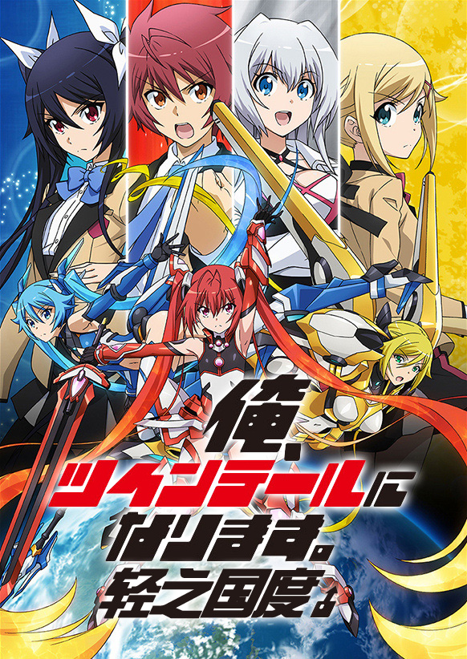

# 俺、ツインテ�`ルになります。

## STORY

「我要成为双马尾」是作者水泽梦作为作家的出道作品，曾获得了第6回小学馆轻小说大奖的审查员特别奖。

本作主要讲述了特别喜爱少女向发型“双马尾”的高中1年级学生观束总二，在某日突然被来自异世界的少女图艾尔授予了双马尾幼女战士“红尾战士”的变身能力。同时，总二所处的世界出现了以人类的精神能源“属性力”为粮食的异世界怪物，作为这些怪物目标的双马尾们正面临着危机。
 
## STAFF

- 监督：神户洋行
- 助监督：喜多幡彻
- 系列构成：荒川稔久
- 角色设计：森田和明
- 动作监督/属性异形设计：山根理宏
- 3D导演：渡边哲也
- 设定设计：Studio NOISE
- 色彩设定：铃城留美子
- 音乐：高梨康治（Team-MAX）
- 音响监督：��本崇宏
- 动画制作：Production IMS
- 制作：制作委员会要成为双马尾
 
## CAST

- 观束总二：岛崎信长
- 津边爱香：相坂优歌
- 神堂慧里那：赤崎千夏
- 朵艾儿：内田真礼
- 红马尾：上坂��
- 善沙暗子[伊丝娜]：日笠阳子
- 观束未春：五十岚裕美
- 樱川尊：M・A・O
- 罪恶魔蜥：玄田哲章
- 罪恶魔龙：稻田彻
 
## HP

http://www.tbs.co.jp/anime/ore_twi/