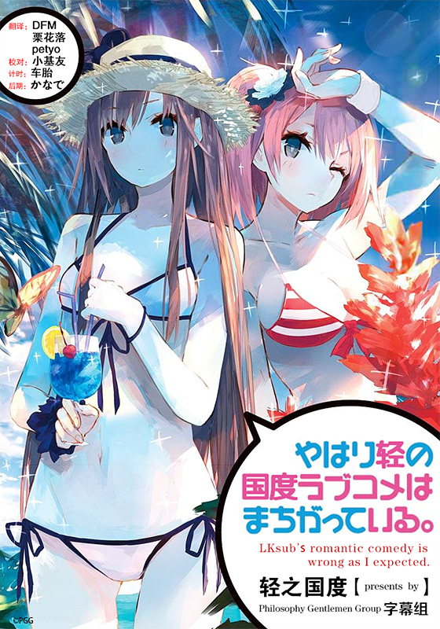

# やはり俺の青春ラブコメはまちがっている。

## STORY

别扭的，没有朋友，没有女朋友，对着那些讴歌青春的同学吐槽着“他们都是骗子，都在说谎，快点爆发吧我”的男主角的爱情物语，将来的梦想是“不工作”——

这样的高中生八幡被生活指导老师的带到了学校第一美少女雪乃所属的“侍奉部”，与美少女意想不到的相遇……怎么想都是恋爱故事的展开吧！？

但是雪乃却无论如何都原谅不了八幡那令人残念的糟糕性格！

不断轮回着的充满问题的青春——我的青春，到底怎么了！？

## STAFF

- 原作：渡航（小学馆「GAGAGA文库」刊）
- 角色原案：ぽんかん⑧
- 监督：吉村爱
- 系列构成：菅正太郎
- 角色设定：进藤优
- 美术监督：池田繁美
- 色彩设计：辻田邦夫
- 编辑：关一彦
- 美术设定：池田繁美・大久保修一(ATELIER MUSA)
- 音乐：石滨翔・MONACA
- 音响监督：本山哲
- 动画制作：Brain's·Base

## CAST

- 比企谷八幡：江口拓也
- 雪之下雪乃：早见沙织
- 由比浜结衣：东山奈央
- 户冢彩加：小松未可子
- 材木座义辉：桧山修之
- 比企谷小町：悠木碧
- 平冢静：柚木凉香
- 雪之下阳乃：中原麻衣
- 叶山隼人：近藤隆
- 三浦优美子：井上麻里奈
- 海老名姬菜：佐佐木望
- 川崎沙希：小清水亚美

## 官方网站

http://www.tbs.co.jp/anime/oregairu/
