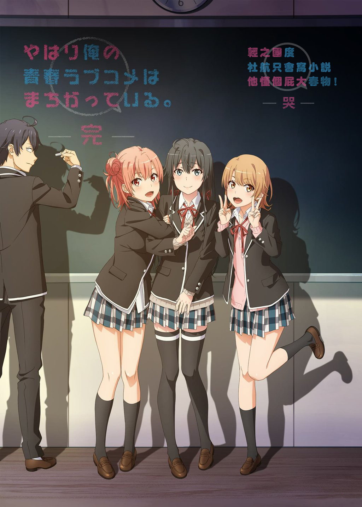

# やはり俺の青春ラブコメはまちがっている。完 

## STORY

反人类题材大老师什么时候变成党争动画了？

## STAFF

- 原作：渡航（小学馆「GAGAGA文库」）
- 角色原案：PONKAN⑧
- 监督：及川启
- 系列构成：大知庆一郎
- 角色设计：田中雄一
- 美术监督：池田繁美、丸山由纪子
- 美术背景：Atelier Musa
- 色彩设计：岩井田洋
- 摄影监督：中村雄太
- 编辑：平木大辅
- 音响监督：本山哲
- 音响制作：Delfi Sound
- 音乐：石滨翔（MONACA）、高桥邦幸（MONACA）
- 音乐制作：NBC Universal Entertainment、Marvelous
- 制作工作室：feel.

## CAST

- 比企谷八幡：江口拓也
- 雪之下雪乃：早见沙织
- 由比滨结衣：东山奈央
- 一色彩羽：佐仓绫音
- 比企谷小町：悠木碧
- 户冢彩加：小松未可子
- 叶山隼人：近藤隆
- 材木座义辉：桧山修之
- 平冢静：柚木凉香
- 雪之下阳乃：中原麻衣
- 三浦优美子：井上麻里奈
- 海老名姬菜：佐佐木望
- 川崎沙希：小清水亚美
- 户部翔：堀井茶渡

## HP

https://www.tbs.co.jp/anime/oregairu/