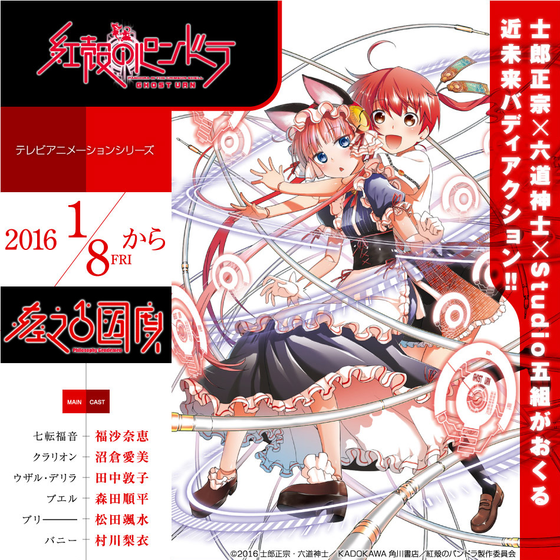

# 紅殻のパンドラ -GHOST URN-

## STORY

大佐从良了 最近喜欢看百合了

## STAFF

- 原作：《红壳的潘多拉》（角川Comics Ace刊）
- 原案：士郎正宗
- 漫画：六道神士
- 企划：菊池刚、工藤大丈
- 监督：名和宗则
- 角色设计：谷拓也
- 总作画监督：谷拓也
- 主动画师：武本大介
- 音响制作：乐音舍
- 音乐制作：Lantis
- 动画制作：Studio五组、AXsiZ
- 制作：红壳的潘多拉制作委员会

## CAST

- 七转福音：福沙奈惠
- 库拉莉翁：沼仓爱美
- 乌萨尔·黛利拉：田中敦子
- 布耶尔：森田顺平
- 布里：松田飒水
- 巴尼：村川梨衣
- 昆仑八仙拓美：三宅麻理惠
- 罗伯特·阿尔特曼：稻田彻
- 伊恩·库尔茨：诹访部顺一
- 艾米·吉利亚姆：长绳麻理亚

## HP

http://k-pandora.com/
