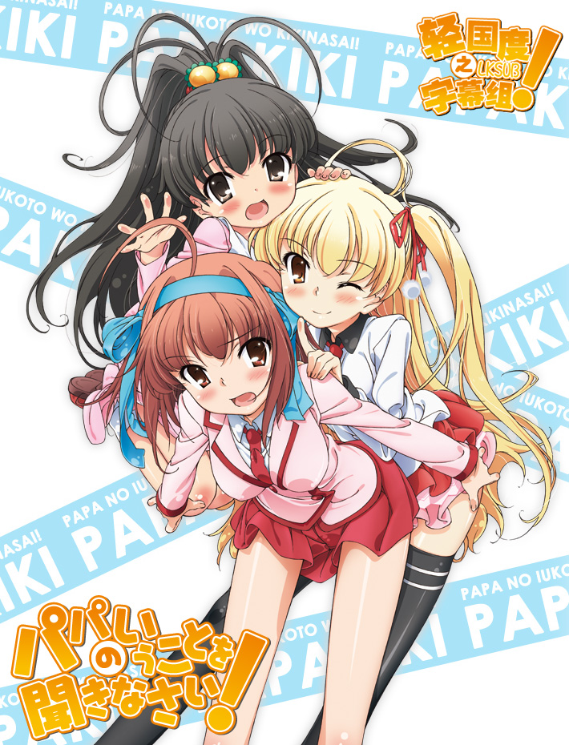

# パパのいうことを聞きなさい!

## STORY

主人公濑川祐太，本来是一名普通的大学生。自幼抚养其长大的姐姐喜欢上了一名有两个女儿的年长男人小鸟游信吾，与他结婚并生下孩子。根深蒂固的姐控（本人 自称）——濑川祐太因此感到消沉并减少了与姐姐的往来。然而因为航空事故，小鸟游夫妇被认定为罹难。此时濑川祐太义无反顾地将小鸟游三姐妹接回家中，并成 为了他们的父亲！？开心热闹又感动满点的轻喜剧就此展开。

## STAFF

- 原作：松智洋／插画：なかじまゆか（集英社Super Dash文库）
- 监督：川崎逸朗
- 助监督：及川启
- 系列构成：荒川稔久
- 脚本：荒川稔久、成田良美、あみやまさはる、大知庆一郎
- 角色设定：豆冢隆
- 美术：Studio美峰
- 美术监督：小滨俊裕（Studio美峰）
- 音响监督：岩浪美和
- 音响效果：小山恭正
- 录音Studio：Studio Mouse
- 音响制作：STUDIO MAUSU
- 音乐制作：STARCHILD
- 动画制作：feel.
- 制作：PPP

## CAST

- 濑川佑太：羽多野涉
- 小鸟遊空：上坂堇
- 小鸟遊美羽：喜多村英梨
- 小鸟遊雏：五十岚裕美
- 织田莱香：堀江由衣
- 仁村浩一：小野大辅
- 佐古俊太郎：间岛淳司
- 小鸟遊佑理：大原沙耶香
- 小鸟游信吾：飞田展男

## HP

http://www.starchild.co.jp/special/papakiki/
