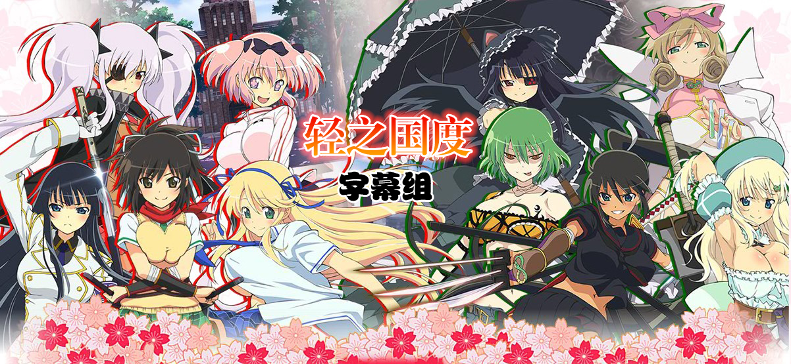

# 閃乱カグラ

## STORY

故事的舞台设立在一个现今还有忍者存在的世界，讲述了在忍者养成机关"国立半藏学院"就读的5名少女对抗恶势力的故事。

## STAFF

原作：高木谦一郎（「闪乱神乐 -少女们的真影-」MarvelousAQL） 　　
监督： 渡部高志 　　
系列构成·脚本：吉冈孝夫 　　
角色设定·总作画监督：鸟居贵史 　　
角色原案：八重樫南 　　
剧本原案协力：北岛行德 　　
制片：GENCO 　　
动画制作：ARTLAND

## CAST
　　
飞鸟：原田瞳 　　
斑鸠：今井麻美 　　
葛城：小林优 　　
柳生：水桥香织 　　
云雀：井口裕香 　　
焰：喜多村英梨 　　
咏：茅野爱衣 　　
日影：白石凉子

## HP

http://senran.tv/index.html
