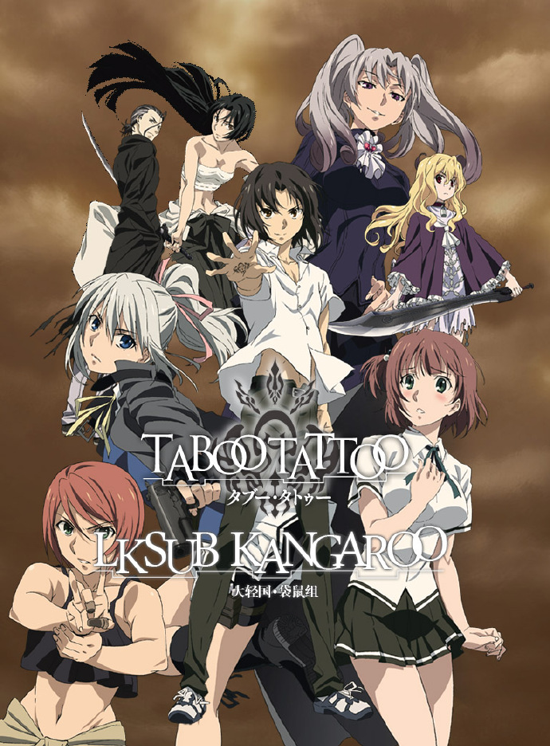

# タブー・タトゥー

## STORY

这是能够引发超常现象的超古代兵器。

通过填充各种特性物质"Trigger"，"咒纹"就会启动。而被称作"印者"的操纵者在身体能力上会得到飞跃性的提升。

赤塚正义帮助了一位被不良混混纠缠的男性。作为回礼，男性送给了正义一块迷之石头。可就在正义接过石头的瞬间，他的手心上被刻印了不可思议的咒纹。

"这个咒纹是从哪得到的？"

第二天，从学校回家的途中，正义被一位穿着与季节不符的大衣少女突然袭击。虽然正义用祖父教授的柔术进行反击，但面对力量上的压倒性差距，正义陷入了性命危机。

以偶然得到"咒纹"的赤塚正义为中心，人们互相猜疑的斗争正式拉开了序幕。

## STAFF

- 原作：真じろう
- 监督：渡部高志
- 系列构成、剧本：关岛真赖、大武正光（SEVEN DAYS WAR）
- 角色设计：长谷川真也
- 音响监督：岩浪美和
- 音响制作：Magic Capsule
- 音乐：SuperSweep 细江慎治
- 动画制作：J.C.STAFF
- 制作方：禁忌咒纹制作委员会

## CAST

- 赤冢正义：古川慎
- 布鲁郗·芙尔基：小松未可子
- 一之濑桃子：安济知佳
- 阿耶波多：鬼头明里
- 伊鲁楚弥修：井泽诗织
- R·R·拉卡：津田健次郎
