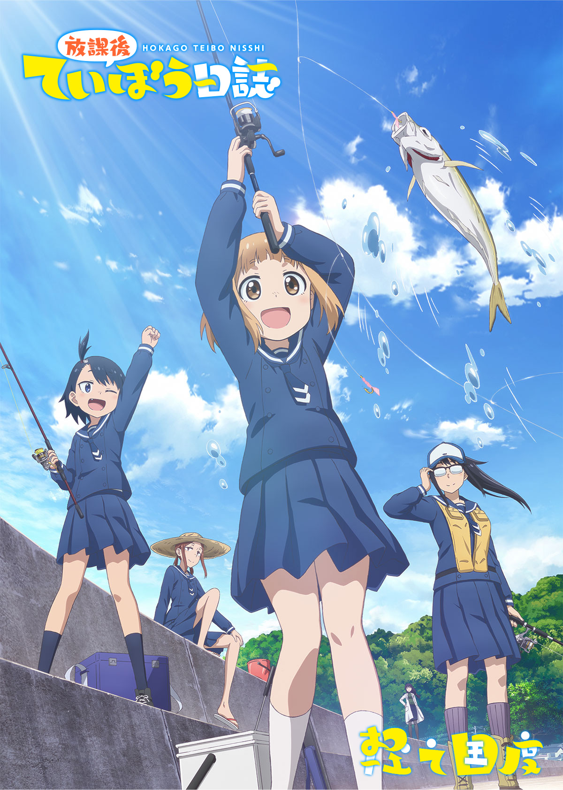

# 放課後ていぼう日誌

## STORY

动画工房钓鱼！

## STAFF

- 原作：小坂泰之（秋田书店《Young Champion 烈》连载）
- 监督：大隈孝晴
- 系列构成：志茂文彦
- 角色设计：熊谷胜弘
- 钓具道具设计：小仓宽之
- 道具设计：永田杏子
- 总作画监督：熊谷胜弘、曾我笃史、市原圭子
- 美术监督：坂下裕太
- 美术设定：东润一
- 美术：STUDIO EASTER
- 色彩设计：真壁源太
- 摄影监督：桑野贵文
- 编辑：小野寺绘美
- 音响监督：高寺雄
- 音乐：樱井美希
- 音乐制作：FlyingDog
- 动画制作：动画工房
- 制作：海野高校堤防部

## CAST

- 鹤木阳渚：高尾奏音
- 帆高夏海：川井田夏海
- 大野真：明坂聪美
- 黑岩悠希：篠原侑

## HP

https://teibotv.com

