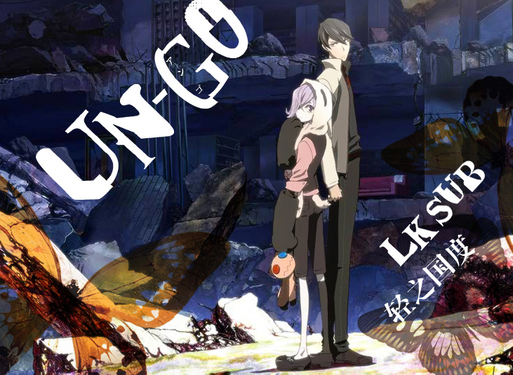

# UN-GO

## STORY

被人称为最后的名侦探结城新十郎，与他的拍档因果，组成了要解明这世上之谜及真实的侦探二人组合。在面对常理不能解释的谜题或案件时，凭着新十郎的推理及因果的协力，这些难题往往也会迎刃而解。但是，当新十郎对案件越发思考之时，他便发现某些地方的不对劲，并随着他的深入了解，他和因果更渐渐与某件大事件扯上关系。

## STAFF

- 原案：坂口安吾「明治开化 安吾捕物帖」
- 监督：水岛精二
- 故事・脚本：会川升
- 角色设定：pako、高河弓
- 动画角色设定・总作画监督：稻留和美、矢崎优子、矢口博子
- 美术设定：宫本崇、胁威志
- 制作设定：宫本崇、石垣纯哉、柳濑敬之
- 美术监督：胁威志
- 色彩设计：中山志穂子
- 撮影监督：佐佐木康太
- 音响监督：三间雅文
- 音乐：NARASAKI
- 动画制作：BONES
- 制作：「UN-GO」制作委员会

## CAST

- 结城新十郎：胜地凉
- 因果：丰崎爱生
- 海胜梨江：山本希望
- 虎山泉：本田贵子
- 速水星玄：入野自由
- 海胜麟六：三木真一郎
